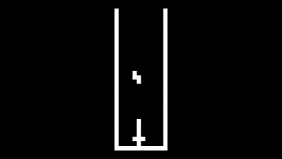

# CHIP-8 Emulator

A cycle-accurate CHIP-8 emulator written in C++20. Built as a systems programming exercise covering CPU emulation, binary decoding, fixed-timestep game loops, and SDL3 audio/video.

> Supports both classic CHIP-8 (legacy wrap-around behaviour) and SUPER-CHIP (modern clip behaviour) via a compile-time `LEGACY` flag.

---

## Demo



---

## Features

- All 35 CHIP-8 opcodes implemented and tested
- Type-safe opcode decoding via `std::variant` and `std::visit`
- O(1) opcode dispatch using a static decode table of lambdas
- Fixed-timestep main loop: CPU runs at 500 Hz, timers at 60 Hz, fully decoupled
- SDL3 audio using the AudioStream API with a square wave beep
- SDL3 display rendered through a streaming texture with nearest-neighbour scaling
- RAII ownership of all SDL3 resources via `std::unique_ptr` with custom deleters
- Headless build mode (`-DCHIP8_HEADLESS=ON`) for running unit tests without a display
- AddressSanitizer and UBSan enabled in Debug builds
- GoogleTest unit test suite for CPU opcodes and the memory subsystem

---

## Architecture

The emulator is split into self-contained subsystems, each owning exactly the state it is responsible for. A top-level `Emulator` facade owns all subsystems and runs the main loop. `main.cpp` only ever touches `Emulator`.

```
Emulator
+-- Memory      4KB flat array, ROM loader, fontset init
+-- Display     64x32 framebuffer, SDL3 window/renderer/texture
+-- Keypad      16-key boolean state array
+-- Audio       SDL3 AudioStream, square wave PCM generation
+-- CPU         registers, stack, timers, fetch/decode/execute
                (holds references to Memory, Display, Keypad, Audio)
```

### Subsystem responsibilities

**Memory** owns the 4096-byte RAM array. It provides bounds-checked `read` and `write` methods, loads the fontset into `0x050-0x09F` at startup, and loads ROM data into `0x200` onward. In debug builds, writes below `0x200` emit a warning.

**CPU** owns the 16 general-purpose registers (`V0`-`VF`), the 16-bit index register `I`, the program counter `PC` (starts at `0x200`), a 16-level stack with stack pointer, and the delay and sound timers. It holds non-owning references to all other subsystems. The `cycle()` method runs one fetch-decode-execute iteration. Timer decrement is separated into `update_timers()`, which is called at 60 Hz.

**Display** owns the 64x32 framebuffer as a flat `uint16_t` array. `draw_sprite()` XORs an 8-wide sprite row into the framebuffer and returns `true` on collision. `render()` uploads the framebuffer to an SDL3 streaming texture and presents it. A `draw_flag` ensures `render()` is only called when the framebuffer has actually changed.

**Keypad** owns a `bool[16]` key state array. `press_key()` and `release_key()` are called by the `Emulator` input handler. `is_key_pressed()` is called by the CPU during opcode execution.

**Audio** owns an SDL3 `AudioStream`. `start_beep()` generates one timer tick's worth of square wave PCM samples and pushes them into the stream. `stop_beep()` clears the stream immediately. Audio is driven by the CPU's `update_timers()` -- the sound timer's non-zero state triggers beeping.

---

## Opcode Decoding

Opcodes are decoded in two stages.

First, a static decode table -- a `std::array` of 16 lambdas, one per top nibble -- dispatches on the highest 4 bits of the raw 16-bit opcode in O(1). Each lambda extracts the relevant fields (`X`, `Y`, `N`, `NN`, `NNN`) from the remaining 12 bits and constructs the appropriate opcode struct.

Second, each of the 35 opcodes is a distinct struct (e.g. `DrawSprite`, `AddEQ`, `FlowGoto`) carrying only the fields relevant to that instruction. All 35 structs are unified into a single `using Opcode = std::variant<...>` type.

Execution uses `std::visit` with an `OpcodeExecutor` visitor struct. Each opcode struct has a corresponding `operator()` overload. A missing handler is a compile error, not a runtime bug.

```
fetch()   -- raw uint16_t from memory at PC
decode()  -- dispatch table -> Opcode variant
execute() -- std::visit(OpcodeExecutor, opcode)
```

---

## Legacy vs Modern Behaviour

CHIP-8 has two conflicting sets of behaviours stemming from the original 1970s interpreter and the 1990s SUPER-CHIP extensions. This emulator handles the divergence with a compile-time `LEGACY` macro.

| Behaviour | LEGACY (CHIP-8) | Modern (SUPER-CHIP) |
|---|---|---|
| Sprite horizontal overflow | Wrap to left edge | Clip at right edge |
| Sprite vertical overflow | Wrap to top edge | Clip at bottom edge |
| `8XY6` / `8XYE` shift | Operates on VY, stores in VX | Operates directly on VX |
| `BNNN` jump | `PC = NNN + V0` | `PC = XNN + VX` |
| `FX55` / `FX65` | Increments I | I unchanged |

Pass `-DLEGACY` or set it in the CMake target to build in legacy mode. The default build uses modern (SUPER-CHIP) behaviour.

---

## Project Structure

```
chip8/
+-- CMakeLists.txt              root build config, sanitizer flags, SDL3 discovery
+-- flake.nix                   Nix dev environment (clang, SDL3, GTest, lcov)
+-- src/
|   +-- CMakeLists.txt          chip8_lib static library + chip8 executable
|   +-- main.cpp                SDL init, arg parsing, Emulator boot
|   +-- chip8/
|   |   +-- emulator.h/.cpp     facade: owns all subsystems, main loop
|   +-- cpu/
|   |   +-- cpu.h/.cpp          fetch/decode/execute, OpcodeExecutor visitor
|   +-- memory/
|   |   +-- memory.h/.cpp       4KB array, ROM loader, fontset
|   +-- display/
|   |   +-- display.h/.cpp      framebuffer, SDL3 texture rendering
|   +-- input/
|   |   +-- input.h/.cpp        Keypad class, key state array
|   +-- audio/
|   |   +-- audio.h/.cpp        SDL3 AudioStream, square wave PCM
|   +-- common/
|       +-- constants.h         constexpr hardware constants, fontset data
|       +-- opcodes.h           35 opcode structs + Opcode variant definition
|       +-- shared_libs.h       all standard library includes
+-- tests/
|   +-- CMakeLists.txt
|   +-- test_memory.cpp
|   +-- test_cpu.cpp
+-- roms/
    +-- test/                   chip8-test-suite ROMs (timendus)
    +-- games/                  game ROMs
```

---

## Building

### Prerequisites

This project uses a [Nix flake](https://nixos.wiki/wiki/Flakes) for reproducible dependency management. If you are on NixOS or have Nix installed:

```bash
nix develop
```

This drops you into a shell with `cmake`, `ninja`, `clang`, `clang-tools`, `sdl3`, `gtest`, and `lcov` available.

If you are not on Nix, install the following manually:

- CMake >= 3.20
- Clang (C++20 support)
- Ninja
- SDL3
- GoogleTest

### Debug build

```bash
cmake -B build -G Ninja -DCMAKE_BUILD_TYPE=Debug -DCMAKE_CXX_COMPILER=clang++
cmake --build build
./build/chip8 roms/games/PONG
```

AddressSanitizer and UBSan are enabled automatically in Debug builds.

### Release build

```bash
cmake -B build -G Ninja -DCMAKE_BUILD_TYPE=Release -DCMAKE_CXX_COMPILER=clang++
cmake --build build
```

### Headless build (tests only, no SDL required)

```bash
cmake -B build -G Ninja -DCMAKE_BUILD_TYPE=Debug -DCHIP8_HEADLESS=ON
cmake --build build
ctest --test-dir build --output-on-failure
```

---

## Running Tests

```bash
cmake -B build -G Ninja -DCMAKE_BUILD_TYPE=Debug -DCHIP8_HEADLESS=ON
cmake --build build

# Run all tests
ctest --test-dir build --output-on-failure

# Verbose output
ctest --test-dir build -V
```

---

## Keyboard Mapping

The original CHIP-8 hexadecimal keypad maps to the following keyboard layout:

```
CHIP-8 Keypad       Keyboard
+---+---+---+---+   +---+---+---+---+
| 1 | 2 | 3 | C |   | 1 | 2 | 3 | 4 |
| 4 | 5 | 6 | D |   | Q | W | E | R |
| 7 | 8 | 9 | E |   | A | S | D | F |
| A | 0 | B | F |   | Z | X | C | V |
+---+---+---+---+   +---+---+---+---+
```

---

## Constants Reference

All hardware constants are in `src/common/constants.h` under the `Chip8` namespace.

| Constant | Value | Description |
|---|---|---|
| `MEMORY_SIZE` | `0x1000` (4096) | Total RAM in bytes |
| `DISPLAY_WIDTH` | `0x40` (64) | Screen width in pixels |
| `DISPLAY_HEIGHT` | `0x20` (32) | Screen height in pixels |
| `DISPLAY_SCALE` | `10` | Window scale multiplier |
| `NUM_REGISTERS` | `0x10` (16) | Number of general-purpose registers |
| `STACK_SIZE` | `0x10` (16) | Stack depth |
| `FONT_START` | `0x050` | Fontset start address |
| `FONT_END` | `0x09F` | Fontset end address |
| `ROM_START` | `0x200` | ROM load address |
| `CPU_HZ` | `500` | CPU cycle rate |
| `TIMER_HZ` | `60` | Timer decrement rate |
| `AUDIO_SAMPLE_RATE` | `44100` | PCM sample rate |
| `AUDIO_FREQUENCY` | `440.0` | Beep tone in Hz (A4) |
| `AUDIO_VOLUME` | `0.05` | Beep amplitude |

---

## Test ROMs

Use the [chip8-test-suite](https://github.com/Timendus/chip8-test-suite) by Timendus to validate correctness. Run them in order:

| ROM | Tests |
|---|---|
| `1-chip8-logo.ch8` | Basic memory, display, and PC |
| `2-ibm-logo.ch8` | More complex drawing |
| `3-corax+.ch8` | All arithmetic and logic opcodes with pass/fail display |
| `4-flags.ch8` | VF flag behaviour |
| `5-quirks.ch8` | LEGACY vs modern behavioural quirks |

Get the full test suite passing before moving on to game ROMs (PONG, TETRIS, SPACE INVADERS).

---

## C++ Patterns Used

- `std::variant` + `std::visit` for type-safe opcode dispatch; missing handlers are compile errors
- Static decode table (`std::array<std::function<Opcode(uint16_t)>, 16>`) for O(1) routing by top nibble
- RAII via `std::unique_ptr` with custom deleters for `SDL_Window`, `SDL_Renderer`, `SDL_Texture`, and `SDL_AudioStream`
- `std::span` for passing ROM data to `Memory::load()` without coupling to a specific container
- `constexpr` for all hardware constants, usable in template parameters and array sizes
- Reference-based dependency injection: CPU holds `Memory&`, `Display&`, `Keypad&`, `Audio&`; ownership stays in `Emulator`
- `std::mt19937` seeded with `std::random_device` for the `CXNN` random opcode

---

## License

MIT -- see `LICENSE`.
